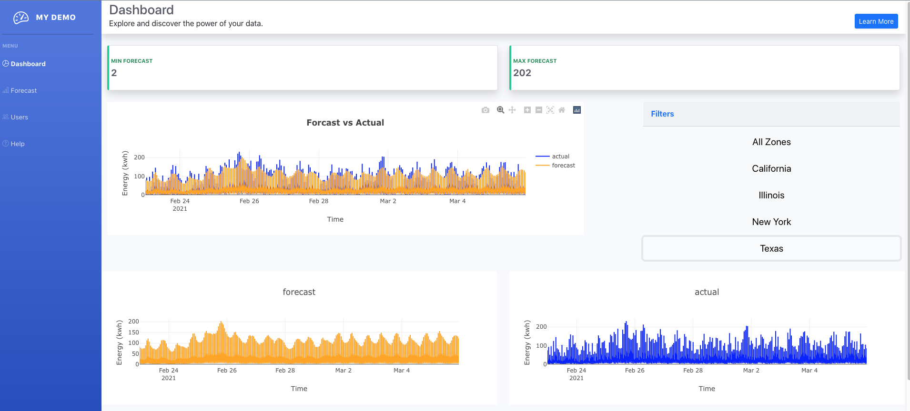

# Energy_Consumption_Dashboard

## Table of Contents

* [Description](#description)
* [Installation](#installation)
* [Tools](#tools)
* [Contact](#contact)
* [Acknowledgements](#acknowledgements)

## Description

A dashboard that displays three graphs (with meter level electric energy consumption data for the short term (10 days ahead)), two numbers (min and max forecast), and a set of filters. 

The main graph displays two bar graphs, one for the forecast values color coded orange, and another for the actual values color coded blue. The bottom left graph displays only the forecast values, and the bottom right graph displays only the
actual values.

The top min and max forecast values represents the min and max value of the graphed forecast.
 
The zone filters are used to dipict json dataset that represents meter level forecasts and actual energy readings for 15 meters each tied to a specific zone (New York | Illinois | Texas | California).

When a user clicks on a specific zone all graphs and min /
max values update to display the data corresponding to the aggregated sum values of the meters in the
selected zone. 

Finally, the goal of this dashboard app is for users to gain a big picture understanding of the energy reading by actual energy consumption and forecast in order to make informed data driven decisions. 

## Installation

* Clone the repo (please reference the links below).
```
git@github.com:Kimberly-Rodriguez/Energy_Consumption_Dashboard.git

```

The following image demonstrates the dashboard homepage's appearance and functionality for All Zones:


The following image demonstrates the dashboard results homepage's appearance and functionality for California zone:


The following image demonstrates the dashboard results homepage's appearance and functionality for Illinois zone:


The following image demonstrates the dashboard results homepage's appearance and functionality for New York zone:


The following image demonstrates the dashboard results homepage's appearance and functionality for Texas zone:




## Tools

This application was made using HTML, CSS, Bootstrap, Javascript, Plotly, Node.js, Express.js and React .

To use this application the following npm packages are needed: bootstrap-icons, font-awesome, react, react-bootstrap, react-dom, react-plotly.js, cors, express. 

To learn more about how to use this data, check out the data.json located inside [Innowatts](https://drive.google.com/drive/folders/1MtoF85tQuc0KtJzaMmjnDuDC9IlkW24h?usp=sharing) google folder.


## Contact

If you have any questions about my work please contact me via email: krodriguez.ucla@gmail.com OR feel free to connect via GitHub: [Kimberly-Rodriguez](https://github.com/Kimberly-Rodriguez).


## Acknowledgements

[Innowatts](https://www.innowatts.com/our-product/)

